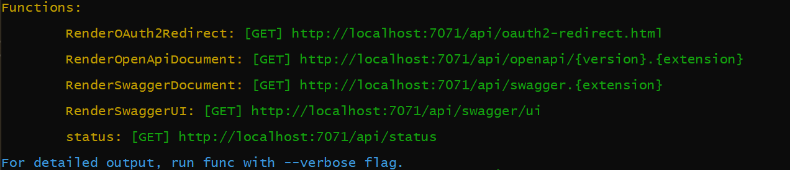

[](https://truevote.org)

[](https://twitter.com/TrueVoteOrg)
[](https://keybase.io/team/truevote)

[](https://github.com/TrueVote/TrueVote.Api/actions/workflows/truevote-api-appservice.yml)
[](https://coveralls.io/github/TrueVote/TrueVote.Api)

# TrueVote.Api

## 🌈 Overview

TrueVote.Api is the core backend for [TrueVote](https://truevote.org).

The main technology stack platform is [.NET Core](https://dotnet.microsoft.com/) 8.0.

## 🛠 Prerequisites

* Install Visual Studio 2022 (preview) or later, or Visual Studio Code. Ensure that `$ dotnet --version` is at least 8.0.
* Install Azure [CosmosDB Emulator](https://learn.microsoft.com/en-us/azure/cosmos-db/local-emulator-release-notes)

## ⌨️ Install, Build, and Serve the Site

Create a new file at the root of the TrueVote.Api project named `appsettings.json` with the following contents:

```json
{
  "Logging": {
    "LogLevel": {
      "Default": "Information",
      "Microsoft.AspNetCore": "Warning",
      "Microsoft": "Warning",
      "Microsoft.Hosting.Lifetime": "Information",
      "Microsoft.AspNetCore.Mvc.ApiExplorer": "Debug"
    },
    "Console": {
      "IncludeScopes": true,
      "LogLevel": {
        "Default": "Debug",
        "System": "Information",
        "Microsoft": "Information",
        "Microsoft.AspNetCore.Mvc.ApiExplorer": "Debug"
      }
    }
  },
  "SystemAdminUserIds": [
    "<UserId>"
  ],
  "AllowedHosts": "*",
  "WEBSITE_CONTENTAZUREFILESCOMPATIBILITYOVERRIDE": 1,
  "AzureWebJobsStorage": "UseDevelopmentStorage=true",
  "ServiceBusApiEventQueueName": "apieventqueue-dev",
  "JWTSecret": "<JWTBase64Key>",
  "ConnectionStrings": {
    "DefaultConnection": "AccountEndpoint=https://localhost:8081/;AccountKey=<AccountKeyFromCosmosDBEmulator>",
    "CosmosDbConnectionString": "AccountEndpoint=https://localhost:8081/;AccountKey=<AccountKeyFromCosmosDBEmulator>",
    "ServiceBusConnectionString": "<ServiceBusConnectionString>"
  }
}
```

Replace the <value> names:

1. `<AccountKeyFromCosmosDBEmulator>` Retrieve the actual account key from the [CosmosDB Emulator start page](https://localhost:8081/_explorer/index.html).

2. Get the `<ServiceBusConnectionString>` from Azure portal. Currently Service Bus is not available to run locally.

3. Create a `<JWTBase64Key>`: `$ openssl rand -base64 32`

4. Once you create a new User, to make that user a SystemAdmin, put the UserId GUID as `<UserId>` inside `SystemAdminUserIds`.

### Install the packages

```bash
$ dotnet restore
$ dotnet tool restore
```
Open TrueVote.Api.sln solution in Visual Studio, and build the solution.

You'll see output in the console showing the various local URL access points.



Swagger root [`https://localhost:7253/swagger/index.html`](https://localhost:7253/swagger/index.html)

GraphQL root [`https://localhost:7253/api/graphql`](https://localhost:7253/api/graphql)

## 🧪 Unit Testing

Unit testing and code coverage are setup and **must** be maintained. To run the tests and generate a coverage report, run the Powershell script from the command line.

```bash
$ powershell ./scripts/RunTests.ps1
```

This generates a coverage report in `TrueVote.Api.Tests/coverage-html`. Open `index.html` to view the report.

## 📮 Making requests via Postman

[Postman](https://www.postman.com/) is a useful tool for testing Apis. TrueVote has a [hosted workspace](https://www.postman.com/truevote/workspace/truevote-api) containing a collection of useful example endpoints and their usage.

## 🎁 Versioning

TrueVote.Api uses [sementic versioning](https://semver.org/), starting with 1.0.0.

The patch (last segment of the 3 segments) is auto-incremented via a GitHub action when a pull request is merged to master. The GitHub action is configured in [.github/workflows/truevote-api-version.yml](.github/workflows/truevote-api-version.yml). To update the major or minor version, follow the instructions specified in the [bumping section of the action](https://github.com/anothrNick/github-tag-action#bumping) - use #major or #minor in the commit message to auto-increment the version.

## ❤️ Contributing

We welcome useful contributions. Please read our [contributing guidelines](CONTRIBUTING.md) before submitting a pull request.

## 📜 License

TrueVote.Api is licensed under the MIT license.

[]((https://github.com/TrueVote/TrueVote.Api/master/LICENSE))

[truevote.org](https://truevote.org)
<!---
Icons used from: https://emojipedia.org/
--->